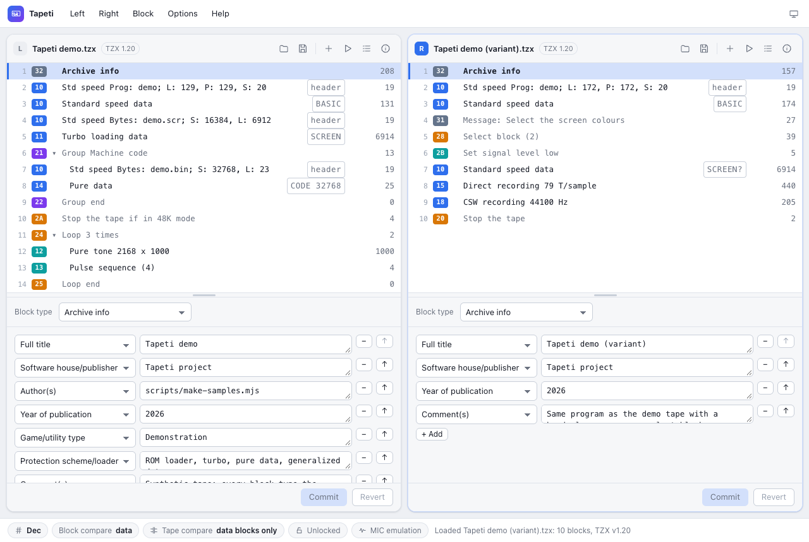

# Tapeti

Tapeti is an editor for ZX Spectrum **TZX** and **TAP** tape images, for the desktop and the
browser. Everything runs locally; no files are uploaded anywhere.



## Download

Desktop builds for macOS, Linux and Windows are attached to each
[GitHub release](../../releases).

| Platform | File | Requirements |
|---|---|---|
| macOS 10.14+ (Intel), 11+ (Apple Silicon) | `.dmg` or `.zip` | The bundle is unsigned: run `xattr -cr /Applications/Tapeti.app` once, or open it from System Settings > Privacy & Security. |
| Linux | `.AppImage` or `.tar.gz` | glibc 2.35 (Ubuntu 22.04 and newer); ALSA for sound. |
| Windows 10+ | `.msi`, or the portable `.exe` | Nothing: the app is one self-contained binary. |

The desktop app is a single native executable — no WebView2, no system WebKit, no WebKitGTK —
and the `.tzx`/`.tap` file associations come with the bundle (macOS) or the installer (Windows).

The browser version is the same app without native file dialogs: Open reads a file you pick,
Save downloads a copy. It works in Safari 14.1, Chrome 90, Firefox 90 and newer. To run it
yourself, see [Building from source](#building-from-source).

## Features

**Two tape windows** (Left / Right), each with a numbered block list, a per-block editor and
Commit / Revert buttons. Drag the bar between the tapes to resize them
(double-click for equal widths), and the bar above an editor to resize the editor.

**File formats**: reads and writes TZX 1.20 (blocks 10–19, 20–28, 2A, 2B, 30–33, 35, 5A); unknown
and deprecated blocks are preserved byte for byte. The saved TZX version is the lowest one that can
hold the content, but never lower than the version the file was loaded with, so an unaltered tape
round-trips byte for byte. TAP files are read and written (only data blocks survive TAP export).

**Block operations**: insert any block type, cut / copy / paste / duplicate / delete, move up and
down, drag & drop within and between tapes (hold Alt or Ctrl to copy), group the selection,
collapse and expand groups and loops (a collapsed group acts as one block), multi-select with
Shift-click and Ctrl-click (⌘-click on macOS), undo / redo per tape, lock switch to prevent
accidental edits.

**Collection tapes**: Programs… (Ctrl+J, or the list button in a tape's toolbar) lists the games on
the tape and selects the one you pick. Programs start at BASIC Program headers, at groups that
contain one, and at Select block entries; everything else (headerless custom loaders, stop blocks
between the parts of a multi-load game) stays with the program before it. Select program
(Ctrl+Shift+A) selects the program at the cursor; Extract to other pane (Ctrl+Shift+E) copies the
selection into the other pane as a new tape named after the program, ready for Save As. Group
blocks manually to fix a wrong split.

**Block editors** for every block type: standard / turbo / pure data timings with a ROM-timings
preset, ROM header fields (type, name, length, autostart line, start address), pure tone, pulse
sequence, direct recording (T-states or sample rate), CSW, generalized data (symbol tables and
pilot stream in a text syntax), pause, group, jump, loop, call sequence, return, select,
signal level, text, message, archive info, hardware type (full hardware list), custom info
(with a text editor for `POKEs` blocks) and glue.

**Data window** (Enter, double-click or View data):

- Hex dump with in-place hex and ASCII editing, search pattern with `?` wildcards.
- Header view: the 17 bytes of a ROM header in the fields they stand for — type, name, length and
  both parameters, labelled for the type, and editable there as in the block editor. A header
  block opens on it.
- View as Screen (with FLASH animation, hide attributes, Save to SCR / PNG).
- BASIC listing with hidden-number detection, "Show numbers", Speccy 32-column formatting and 128k
  tokens; variables area listing.
- Text view with Spectrum character set and tokens.
- Z80 disassembly (all prefixes, undocumented forms) with ROM routine labels.
- Base address, flip bytes (RR), reverse order (DEC IX), hide flag / checksum byte modifiers.
  Typing in the dump works through them — the byte lands where the view shows it.
- Bit and byte level Drop / Add / Shift left / Shift right and last-byte mask. These act on the
  raw block data, so they wait until the modifiers are off.
- Append file, replace from file, save block data to file. "View selected as one" joins the
  selected blocks bit-exactly.

**Content labels** in the block list come from the preceding ROM header when there is one. If
the data length differs from the header, the label says so (`SCREEN (short)`, `CODE 32768 (long)`);
blocks without a usable header are guessed from their size and bytes (`SCREEN?`, `BASIC?`).

**Tape tools**: tape info (size, TZX version, estimated playing time, block counts), consistency
check (nesting, useless loops, bad jumps, calls without return, infinite loops, checksums),
compare tapes and find match with block-compare and tape-compare modes (magenta = differs,
grey = ignored, green = match), set selection timings to current block.
Blocks with consistency problems are marked in the block list: a red `!` for errors (invalid
structure, bad jump targets, broken generalized data), an amber `!` for warnings such as a
checksum that does not match or data that is shorter or longer than its header says; hover
for the details. A collapsed group shows the marks of the blocks inside it.

**Audio**: play the tape, play from cursor or play the selection through Web Audio, and export
WAV (8/16-bit, several sample rates) with either a square wave or MIC-emulation waveform. Loops,
jumps, calls and selects are followed as an emulator would. While playing, the status bar shows
elapsed/total time and a progress bar, and the block being played is marked in the list (click
either the status bar or the "Playing" pill to stop).

**Open in emulator** (Tape menu: whole tape; Block menu and context menu: from the cursor, or the
selection): the desktop app writes those blocks to a temporary TZX and starts an emulator with it.
By default it looks for [Fuse](https://fuse-emulator.sourceforge.net/): the Fuse app on macOS, and
`fuse`, `fuse-gtk` or `fuse-sdl` on the PATH or in the usual install folders on Windows and Linux.
Options → Emulator… picks another program (ZEsarUX, Spectaculator, a Flatpak via `flatpak` with
`run <app-id>` as arguments, …) and extra arguments; the tape file is always the last argument.
If the exported part would break jumps, loops or calls, you are asked first. The browser build
downloads the TZX instead.

**Dec / Hex** switch, in the bottom left corner of the main window and of the data window: it
belongs to the screen it is on. The main window's covers the block list, the editor and
the dialogs opened from it; the data window has its own, starting at Dec every time one is opened,
so switching either leaves the other alone. Neither is remembered between sessions, and a field
that wants a number takes `$`/`0x` for hex and `#` for decimal whatever base it is showing.

**Options** menu (remembered between sessions): *Flag and checksum bytes in hex* shows those byte
values as `0xXX` on a screen that is on Dec, *Number blocks from 0* numbers the blocks in the
list, data window, jump/call targets and consistency report the way the file format counts them,
from 0. It is on by default; turn it off for 1-based numbers. The button at the right end of the
menu bar cycles the theme between light, dark and follow-the-system.

### Files on the desktop

Open and Save use native dialogs, **Save (Ctrl+S) writes back to the file you opened**, and `.tzx`
/ `.tap` files are associated with the app so they open with a double click (or by dropping them on
the app icon in the macOS Dock). Tapes can also be opened from the Left / Right menus, dropped onto
a tape pane, or named on the command line — `tapeti left.tzx right.tzx` fills both panes. In the
browser, Save downloads a copy, and tapes can be given in the URL:
`?open=samples/Tapeti%20demo.tzx&right=other.tzx`.

### Keyboard and mouse

The keys are listed here with their Windows and Linux spelling. **On macOS, use ⌘ (Command) in
place of Ctrl and Option in place of Alt**; Delete is the Backspace (⌫) key there.

| Keys | Action |
|---|---|
| Click, Shift+click, Ctrl+click | Current block, select range, toggle selection |
| Double click | View data, or collapse / expand a group or loop |
| Drag & drop | Move blocks within or between tapes; hold Alt or Ctrl to copy |
| Drop a file on a tape | Open it; hold Shift to insert it at the cursor |
| ↑ ↓, Ctrl+↑ Ctrl+↓ | Move cursor, move block |
| Enter, Escape | View data, close window |
| Delete or Backspace | Delete current block or selection |
| Insert (desktop: also Ctrl+Shift+N) | Insert block |
| Ctrl+X, Ctrl+C, Ctrl+V, Ctrl+D | Cut, copy, paste, duplicate |
| Ctrl+Z, Ctrl+Shift+Z, Ctrl+A | Undo, redo, select all |
| Ctrl+O, Ctrl+S | Open / save left tape |
| Ctrl+Shift+O, Ctrl+Shift+S | Open / save right tape |
| Ctrl+G, Ctrl+F | Group selection, find match |
| Ctrl+J, Ctrl+Shift+A, Ctrl+Shift+E | Pick a program, select the program at the cursor, extract selection to the other pane |
| Tab, Space | Switch active tape, play / stop from the cursor |
| Ctrl+R, Ctrl+Shift+R | Open the tape / from the cursor in the emulator (desktop) |

Mac keyboards have no Insert key: use ⌘⇧N in the desktop app, or the + button in
the tape toolbar.

### Not implemented

- Loading CSW files into a CSW block (existing CSW blocks are preserved and played; Z-RLE blocks
  are inflated with [pako](https://github.com/nodeca/pako)).

## Building from source

Tapeti is two builds over one Rust core (`core/`): the desktop app is Rust and
[egui](https://github.com/emilk/egui) (`desktop/`), the browser one a Vite + Preact + TypeScript
front end (`src/`) on the same core compiled to WebAssembly. Node 22 or newer is needed for the
web app, a Rust toolchain for either.

```sh
npm install
npm run dev        # web app at http://localhost:5173
npm run build      # static site in dist/
```

### Desktop app

The desktop build needs a Rust toolchain and the platform's own build tools: Xcode command line
tools on macOS, and on Linux `libasound2-dev` (sound) plus `libxkbcommon-dev`. Nothing else — the
app draws its own UI and has no web view.

```sh
npm run desktop          # release build, plus Tapeti.app on macOS
npm run desktop:debug    # a quicker build, for a run
npm run desktop:test     # cargo test: headless UI frames, the store, the command table
npm run desktop:package  # the files a release carries, into desktop/dist/
```

`npm run desktop:package` writes a `.dmg` and a `.zip` on macOS, an `.AppImage` (when
`appimagetool` is on `PATH`) and a `.tar.gz` on Linux, and a portable `.exe` plus an `.msi` on
Windows (the installer needs the [WiX](https://wixtoolset.org) `wix` command:
`dotnet tool install --global wix`). Add `--universal` on macOS to build both architectures into
one binary, the way the release workflow does.

### Supported systems

| Platform | Minimum | Notes |
|---|---|---|
| macOS | 10.14 on Intel, 11 on Apple Silicon | Both in one universal binary from CI; Apple Silicon never had anything older than 11. |
| Linux | Ubuntu 22.04 (glibc 2.35) | X11 or Wayland, OpenGL 3.3 or GLES, ALSA for sound. |
| Windows | 10 | One executable; the `.msi` only adds the shortcut and the file associations. |
| Browser | Safari 14.1, Chrome 90, Firefox 90 | The build targets these engines explicitly. |

The browser build deliberately avoids `structuredClone`, CSS `:has()`, `color-mix()` and
`DecompressionStream` so it runs on web views that never received updates.

## Development

```sh
npm run typecheck    # tsc --noEmit
npm test             # vitest: parser/writer round trips, flow, audio, disassembler, BASIC, content detection
npm run core:test    # cargo test in core/: the data layer, against the same cases
npm run desktop:test # cargo test in desktop/: the store, the command table, headless UI frames
npm run smoke        # headless-Chrome UI smoke test; screenshots land in scratch/ (dev server must be running)
npm run samples      # regenerate the synthetic sample tapes in public/samples/
```

- `.github/workflows/ci.yml` typechecks, tests and builds the web app, and builds and tests the
  desktop app on macOS, Linux and Windows, on every push.
- `.github/workflows/release.yml` packages the desktop app (macOS universal, Linux, Windows) on
  every `v*` tag, or manually from the Actions tab, and attaches the files to a **draft** GitHub
  release. Push a tag such as `v0.1.0`, then publish the draft from the Releases page.

### Layout

```
core/          the tape core in Rust: parser, writer, descriptions, content detection,
               consistency, programs, compare, convert, audio, BASIC, screens, Z80
desktop/       the desktop app: egui UI, state, commands, playback (cpal), files (rfd)
src/tzx/       the browser build's data layer — thin wrappers over core/, compiled to wasm
src/spectrum/  the same for the BASIC lister, screen renderer and disassembler
src/state/     browser application state (Preact signals), undo/redo, file I/O, command table
src/ui/        Preact components: menus, tape panes, block editor, data window, dialogs
src/platform/  the browser's file boundary: <input type=file> and downloads
test/          Vitest unit tests, plus the frozen reference implementation in test/reference/
scripts/       wasm build, desktop build and packaging, smoke test, sample tape generator
assets/icons/  application icons for the bundles
public/samples synthetic demo tapes, generated by scripts/make-samples.mjs
docs/          screenshots for this README
.github/       CI and release workflows
```

The two builds share everything expensive: parsing, descriptions, consistency, audio, BASIC and
the disassembler all live in `core/`, which the desktop app links as a library and the browser one
calls through WebAssembly. What differs is the UI, and the command table in
`src/state/commands.ts` is checked against the desktop app's copy by `desktop/tests/menu.rs`.

## Credits

TZX is the tape format defined by the [TZX specification](https://worldofspectrum.net/TZXformat.html).
The tapes in `public/samples/` are generated by `scripts/make-samples.mjs` and contain no
third-party software.

## Licence

Tapeti is free software, released under the GNU General Public License version 2 or (at your
option) any later version. See [LICENSE](LICENSE) for the full text.
